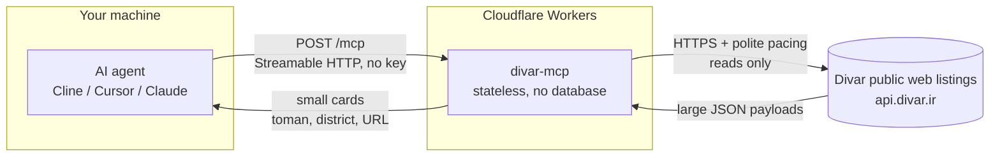

# Divar MCP - Classifieds intelligence for AI agents


A public MCP server that gives AI agents **real Divar knowledge**: search **Iran's largest classifieds**, **prices in Toman**, categories, cities and neighbourhoods, car mileage and phone specs, rental deposit + rent, ad details, side-by-side comparisons and a live price verdict. **Read-only, no key needed. No login, no phone numbers - ever.**

**Live endpoint:** `https://divar-mcp.mmdju.workers.dev/mcp` (Streamable HTTP, stateless)

**[نسخه فارسی](README_FA.md)** · **[Examples](examples/sample-calls.md)** · **[Tool reference](docs/tools.md)** · **[Changelog](CHANGELOG.md)**

## Connect in 30 seconds

Any MCP client, **one URL**. Cline / Cursor / Claude Desktop (`mcp.json` style):

```json
{
  "mcpServers": {
    "divar": { "url": "https://divar-mcp.mmdju.workers.dev/mcp" }
  }
}
```

Then just talk: **"pride under 300 million"**, **"two-bedroom to rent in Tehran"**, **"is this 207 a good deal?"**, **"cheapest iPhone 13 in Mashhad"**.

Agents running in a browser work too - the endpoint answers CORS preflights (`OPTIONS /mcp`).

## 7 tools

| Tool | What it answers |
|---|---|
| `divar_suggest` | Vague wording to **real search terms, category slugs, city and district ids** - across all **237 categories** and **1177 cities** |
| `search_ads` | "Show me X", price checks - **filters, sorting, paging**, one call can scan a window of pages |
| `ad_details` | Everything about one ad: **price, specs, amenities, condition scores, photos, map, expiry, chat flag, seller type - no phone** |
| `get_ads_batch` | Shortlist cards for **up to 10 tokens** - feeds `compare_ads` |
| `compare_ads` | "Which of these?" - **only the specs that actually differ**, plus the middle of the set and where each ad sits |
| `find_best_value` | "Best X under Y Toman" - **ranked picks**, judged against the uncapped market (`market_scale`) |
| `market_price` | **"Is this price normal?"** - the median of a live sample, with its sample size and what it kept out of the maths |

Every tool is read-only (`readOnlyHint: true`) and needs no credentials. The server also speaks MCP **prompts** (`compare-ads`, `best-under-budget`) and **resources** (`divar://cities`, `divar://categories`, `divar://category-filters/{slug}`) - reference data without spending a tool call.

Notes for agent builders:

- **All prices are in Toman** (1 Toman = 10 Rial). Negotiable ads return `price_toman: null` - never 0. Prices move and ads sell in hours - always link the ad URL so the user can confirm before acting.
- **Not every number in a price field is a price.** Divar has no "price on request" field, so a seller who will not publish a price types a fake one: sort a car or phone search by cheapest and the top of the list is a page of ads at `۱,۰۰۰ تومان` from shops inviting نقد و اقساط / تماس بگیرید. Those ads are real listings and are never hidden, but each one carries **`price_is_placeholder`**, a `price_placeholder_kind` (`typed_thousand` · `repeated_digits` · `sentinel_number` · `far_below_market`) and a plain-language `price_note`. A list summarises them in `placeholder_price_ads`, `find_best_value` ranks them after honest asks and never lets one set `cheapest_toman`, and `market_price` lists the ones it kept out of the median in `sample_ads_placeholder_prices`.
- Start vague queries with **`divar_suggest`** to get real search terms, a `category` slug and a city or district id. Names alone do not filter a district - it takes an id.
- Anything with a **budget** or the word **"best"** goes to **`find_best_value`**; plain search only walks the pages you ask for.
- **A price is only as good as its comparison.** `market_price` says exactly how many ads it compared, keeps placeholder prices and توافقی ads out of the maths, and refuses to pass a sample of under 8 ads off as a benchmark. It is **not** Divar's own کارنامه appraisal, and it says so in every answer.
- **Negotiable ads are not hidden lies**: by default `find_best_value` ranks priced ads only; `include_negotiable: true` adds the توافقی picks - last, with `price_toman: null` and an "ask the seller" line.
- Results are **capped** (default 10, max 30) to protect agent context. Persian queries are normalized (yeh/kaf folding, Persian digits, ZWNJ variants) with one automatic retry when a spelling variant comes back empty.
- See **[examples/sample-calls.md](examples/sample-calls.md)** for eight copy-paste conversation flows, and **[docs/tools.md](docs/tools.md)** for the full parameter reference.

## What it supports

Divar's own filters, mapped to real API keys - not a guess at what might work.

**Everything:** `query` (Persian or English), `category` (any of the 237 slugs), `city` or `cities` (up to 5 at once), `districts`, `min/max_price_toman`, `sort` (`newest` · `cheapest` · `most_expensive`; needs a `category` - Divar only orders by price inside one), `seller_type`, `exchange` (only / exclude swaps; needs a category that has the filter), `only_photo`, `only_video`, `limit`, `page` (1-based, max 50) and `pages` (scan and merge up to 5 pages in one call, deduplicated).

**Cars:** `brand_model` (resolved from Divar's own model list, e.g. `audi q4`), `min/max_mileage_km`.

**Phones:** `brand_model`, `condition` (`new` · `like-new` · `used` · `repair-needed`), `min/max_storage_gb`, `min/max_ram_gb`, `color`, `sim_slots` (`1` · `2` · `3+`), `installment`.

**Homes, for rent and for sale:** `min/max_size_sqm`, `rooms` (Persian count words, e.g. `["سه"]`), `parking`, `elevator`, `warehouse`, `balcony`; rentals (`apartment-rent`) also take `min/max_credit_toman` (ودیعه) and `min/max_rent_toman`. Buy leaves (`apartment-sell`, `house-villa-sell`, `residential-sell`, `commercial-sell`, `office-sell`, `shop-sell`, `plot-old`…) each honour a verified subset - a filter that a leaf does not support is reported in `filters_not_applied` instead of being sent anyway.

**Details that decide a purchase:** each ad carries the specs from Divar's own rows - mileage and year and colour on a car, size and year built and rooms on a home - plus the amenities (with the "ندارد" rows split into `amenities_absent`), Divar's condition assessment (`condition_scores`), `expires_at`, `chat_enabled`, `seller_type` and a `price_source` saying where the number came from.

**Not supported, on purpose:** posting, editing, chat, marking ads, saved searches and phone numbers - all of it needs the seller's own login, and this server never logs in. Also absent: urgent-only search, shop-only search, car production year, server-side video-only, a single store's ad list (it answers `403` without a login) and per-district ad counts on the map. Each of those was probe-tested against the real API and left out rather than faked.

## How it works

How a question becomes an answer. No user data is stored anywhere in this path.



What this means:

- **Stateless.** Every request stands alone - no sessions, no accounts, nothing to log in to.
- **Read-only.** All 7 tools carry `readOnlyHint`. Nothing here can post, change or delete anything.
- **No user data.** Nothing about you is stored. What the server does keep: a short-lived response cache (10 minutes for searches and ads, 24 hours for the city/category lists) so asking the same thing twice costs one upstream call.
- **Rate-limit aware.** Search requests go out 800 ms apart, ad details 2 s apart with backoff, and Divar's model lists are cached for a day - a burst on your side never leaves this server as a burst.
- **Undocumented upstream.** Divar's public API can change without notice, so the projection is written defensively and the [verify script](scripts/verify-live.mjs) exists to catch drift.

## Trust, verified

Don't take my word for it - check the live server yourself:

```bash
node scripts/verify-live.mjs   # needs Node.js 18+, nothing to install
```

It lists all 7 tools over Streamable HTTP, runs a search + details read + a `market_price` pricing + a privacy sweep + error paths, asserts the honest-data contract (Toman prices, negotiable = `null`, actionable errors), and compares the version the live service reports against the newest release in this repo - so a deployment that lags these docs cannot stay quiet. The same script runs **hourly in CI** ([](https://github.com/mmdju/divar-mcp/actions/workflows/verify.yml) - if the endpoint or Divar's API drifts, the badge goes red). See [docs/architecture.md](docs/architecture.md) for how a question becomes an answer, and [examples/python.py](examples/python.py) for a copy-paste client.

## Privacy

Phone numbers need the seller's own login, and **this server never logs in and never returns them**. Verified live: no `phone`, `mobile` or `contact_number` field appears anywhere in search results or ad details. Ads are linked, not contacted - the user talks to the seller themselves.

## Data source

Divar's public web listings (**undocumented, may change without notice**). This project is **not affiliated with or endorsed by Divar**.

## Status

**Free public service** on Cloudflare Workers. **Fair use: 60 requests per minute per IP** on `/mcp` (HTTP 429 with `retry-after`) - enforced in the server *and* by a Cloudflare edge rule, details in [SECURITY.md](SECURITY.md). A normal agent session never comes close, because Divar's own pacing caps a client at about one tool call per second anyway.

## License

Showcase repository (**docs only, no source published**) - see [LICENSE](LICENSE). Security notes in [SECURITY.md](SECURITY.md). Persian version in [README_FA.md](README_FA.md).
