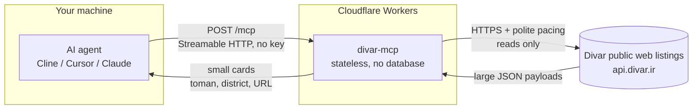

# Divar MCP - Classifieds intelligence for AI agents


A public MCP server that gives AI agents **real Divar knowledge**: search **Iran's largest classifieds**, **prices in Toman**, categories and neighbourhoods, car mileage and phone specs, rental deposit + rent, ad details, side-by-side comparisons and a live price verdict. **Read-only, no key needed. No login, no phone numbers - ever.**

**Live endpoint:** `https://divar-mcp.mmdju2.workers.dev/mcp` (Streamable HTTP, stateless)

**[نسخه فارسی](README_FA.md)** · **[Examples](examples/sample-calls.md)** · **[Tool reference](docs/tools.md)** · **[Changelog](CHANGELOG.md)**

## Connect in 30 seconds

Any MCP client, **one URL**. Cline / Cursor / Claude Desktop (`mcp.json` style):

```json
{
  "mcpServers": {
    "divar": { "url": "https://divar-mcp.mmdju2.workers.dev/mcp" }
  }
}
```

Then just talk: **"pride under 300 million"**, **"two-bedroom to rent in Tehran"**, **"is this 207 a good deal?"**, **"cheapest iPhone 13 in Mashhad"**.

Agents running in a browser work too - the endpoint answers CORS preflights (`OPTIONS /mcp`).

## 7 tools

| Tool | What it answers |
|---|---|
| `divar_suggest` | Vague wording to **real search terms, category slugs, city and district ids** - all **237 categories** and **1177 cities** |
| `search_ads` | "Show me X", price checks - **filters, sorting, paging**; one call can scan and merge up to 5 pages |
| `ad_details` | Everything about one ad: **price, specs, amenities, condition scores, photos, map, expiry, chat flag, seller type** |
| `get_ads_batch` | Shortlist cards for **up to 10 tokens** - feeds `compare_ads`, and each card says who is selling and until when |
| `compare_ads` | "Which of these?" - **only the specs that actually differ**, plus the middle of the set and where each ad sits |
| `find_best_value` | "Best X under Y Toman" - **picks ranked by what the budget reaches**, judged against the uncapped market (`market_scale`) |
| `market_price` | **"Is this price normal?"** - the median of a live sample, with its size and what it kept out of the maths |

Every tool is read-only (`readOnlyHint: true`) and needs no credentials. MCP **prompts** (`compare-ads`, `best-under-budget`) and **resources** (`divar://cities`, `divar://categories`, `divar://category-filters/{slug}`) ride along - reference data without spending a tool call.

Notes for agent builders:

- **All prices are in Toman** (1 Toman = 10 Rial), and a negotiable ad returns `price_toman: null` - never 0. Ads sell in hours, so link the ad URL and let the user confirm.
- **Not every number in a price field is a price.** Divar has no "price on request" field, so a seller who will not publish one types a fake: the cheapest page of a car or phone search is a wall of `۱,۰۰۰ تومان` shop ads inviting نقد و اقساط / تماس بگیرید. They stay in every list, labelled **`price_is_placeholder`** with a `price_placeholder_kind` and a plain-language `price_note`, and they never set a median or `cheapest_toman`. The same finding also travels as **`price_reading`** - what fired, how strong the evidence is (`certain` for a shape, `strong` for one measured against a sample) and the median, sample size and share it was judged against - because how to read the number is the caller's call. `market_price` goes further and publishes its sample under **every** cut it made (`sample_views` / `sample_view_used`), so the raw reading is always one field away.
- **A rent ad has two numbers, and both are checked.** `price_toman` is the monthly rent and `deposit_toman` (ودیعه) rides beside it, each with its own honesty flag - absent means that line is fine. A rent list also mixes a second product: an ad whose **own title** says it is a room in a shared home (`همخونه` / `هماتاقی` / `اجاره اتاق`) carries **`shared_housing`** and is kept out of a `market_price` rent median - a room's price is not a flat's rent.
- Start vague queries with **`divar_suggest`**: a district needs an **id**, a name alone will not filter it.
- Anything with a **budget** or the word **"best"** goes to **`find_best_value`** - plain search only walks the pages you ask for.
- **Negotiable ads are not hidden.** `find_best_value` ranks priced ads first by default; `include_negotiable: true` adds the توافقی picks last, with `price_toman: null` and an "ask the seller" line.
- **`market_price` is not an appraisal.** It says how many ads it compared, keeps placeholder prices and توافقی ads out of the maths, refuses to pass a sample under 8 ads off as a benchmark, and states in every answer that it is not Divar's own کارنامه.
- Results are **capped** (default 10, max 30) and `page` goes up to max 50 - the caps protect agent context. Persian queries are folded (yeh/kaf, Persian digits, ZWNJ) with one automatic retry when a spelling variant comes back empty.
- **[examples/sample-calls.md](examples/sample-calls.md)** has eight copy-paste flows, and **[docs/tools.md](docs/tools.md)** has every parameter, which filters each category honours, and what is deliberately absent.

## How it works

How a question becomes an answer. No user data is stored anywhere in this path.



What this means:

- **Stateless.** Every request stands alone - no sessions, no accounts, nothing to log in to.
- **Read-only.** All 7 tools carry `readOnlyHint`. Nothing here can post, change or delete anything.
- **No user data.** Nothing about you is stored. What the server does keep: a short-lived response cache (10 minutes for searches and ads, 24 hours for the city/category lists).
- **Rate-limit aware.** Search requests go out 800 ms apart, ad details 2 s apart with backoff, and Divar's model lists are cached for a day - load on your side never leaves this server as a burst.
- **Undocumented upstream.** Divar's public API can change without notice, which is exactly why the [verify script](scripts/verify-live.mjs) exists.

## Trust, verified

Don't take my word for it - check the live server yourself:

```bash
node scripts/verify-live.mjs   # needs Node.js 18+, nothing to install
```

It lists all 7 tools over Streamable HTTP, runs a search + details read + a `market_price` pricing + a privacy sweep + error paths, asserts the honest-data contract (Toman prices, negotiable = `null`, actionable errors), and compares the version the live service reports against the newest release in this repo - so a deployment that lags these docs cannot stay quiet. The same script runs **hourly in CI** ([](https://github.com/mmdju/divar-mcp/actions/workflows/verify.yml)). See [docs/architecture.md](docs/architecture.md) for the full path, and [examples/python.py](examples/python.py) for a copy-paste client.

## Privacy

Phone numbers need the seller's own login, and **this server never logs in and never returns them** - no `phone`, `mobile` or `contact_number` field appears in search results or ad details. Ads are linked, not contacted: the user talks to the seller themselves.

## Data source

Divar's public web listings (**undocumented, may change without notice**). This project is **not affiliated with or endorsed by Divar**.

## Status

**Free public service** on Cloudflare Workers. **Fair use: 60 requests per minute per IP** on `/mcp` (HTTP 429 with `retry-after`) - enforced in the server *and* by a Cloudflare edge rule, details in [SECURITY.md](SECURITY.md).

## License

Showcase repository (**docs only, no source published**) - see [LICENSE](LICENSE). Security notes in [SECURITY.md](SECURITY.md). Persian version in [README_FA.md](README_FA.md).
