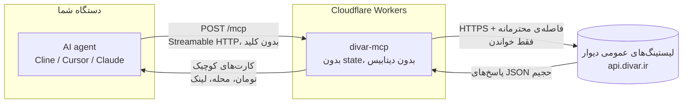

# دیوار MCP - هوش آگهی برای ایجنت‌ها


یه MCP سرور عمومیه که به ایجنت‌های هوش مصنوعی **دانش واقعی دیوار** می‌ده: جستجو تو **بزرگ‌ترین نیازمندی‌های ایران**، **قیمت به تومان**، دسته‌ها، شهرها و محله‌ها، کارکرد ماشین و مشخصات گوشی، ودیعه و اجاره، جزئیات آگهی، مقایسه و یه حکم زنده درباره‌ی قیمت. **فقط خواندنیه، بدون کلید. بدون لاگین و بدون شماره تلفن - هیچ‌وقت.**

**آدرس زنده:** `https://divar-mcp.mmdju.workers.dev/mcp` (Streamable HTTP، بدون state)

**[English version](README.md)** · **[مثال‌ها](examples/sample-calls.md)** · **[مرجع ابزارها](docs/tools.md)** · **[تغییرات](CHANGELOG.md)**

## اتصال در ۳۰ ثانیه

هر MCP کلاینتی، **فقط یه آدرس**. Cline / Cursor / Claude Desktop (استایل `mcp.json`):

```json
{
  "mcpServers": {
    "divar": { "url": "https://divar-mcp.mmdju.workers.dev/mcp" }
  }
}
```

بعدش فقط حرف بزن: **«پراید زیر ۳۰۰ میلیون»**، **«خونه دوخوابه اجاره تو تهران»**، **«این ۲۰۷ می‌ارزه؟»**، **«ارزون‌ترین آیفون ۱۳ تو مشهد»**.

کلاینت‌های MCP توی مرورگر هم کار می‌کنن - endpoint جواب preflight مرورگر (`OPTIONS /mcp`) رو می‌ده.

## ۷ ابزار

| ابزار | به چه دردی می‌خوره |
|---|---|
| `divar_suggest` | حرف مبهم به **عبارت واقعی جستجو، slug دسته، آیدی شهر و محله** - روی هر **۲۳۷ دسته** و **۱۱۷۷ شهر** دیوار |
| `search_ads` | «اینو نشونم بده»، چک قیمت - **فیلتر، مرتب‌سازی، صفحه‌بندی**، با امکان دیدن چند صفحه تو یه call |
| `ad_details` | همه‌چیز یه آگهی: **قیمت، مشخصات، امکانات، ارزیابی وضعیت، عکس، نقشه، انقضا، وضعیت چت، نوع فروشنده - بدون تلفن** |
| `get_ads_batch` | کارت‌های **تا ۱۰ توکن** - ورودی `compare_ads`، و هر کارت می‌گوید فروشنده کیست و آگهی تا کی هست |
| `compare_ads` | «کدومشون؟» - **فقط مشخصاتی که واقعاً فرق دارن**، به‌علاوه میانهٔ همین مجموعه و جای هر آگهی |
| `find_best_value` | «بهترین X زیر Y تومان» - **گزینه‌ها بر اساس چیزی که بودجه‌ات واقعاً به آن می‌رسد رتبه‌بندی می‌شن**، سنجیده با بازار بدون سقف قیمت (`market_scale`) |
| `market_price` | **«این قیمت عادیه؟»** - میانهٔ یه نمونهٔ زنده، با تعداد نمونه و چیزهایی که در حساب نیاورده |

هر ۷ ابزار فقط خواندنیه (`readOnlyHint`) و هیچ کلید یا حسابی نمی‌خواد. سرور علاوه بر ابزارها MCP **prompts** هم داره (`compare-ads` و `best-under-budget`) و **resources** (`divar://cities`، `divar://categories`، `divar://category-filters/{slug}`) - داده‌های مرجع بدون سوزوندن یه tool call.

نکته‌ها برای سازنده‌های ایجنت:

- همه‌ی قیمت‌ها به **تومانن** (۱ تومان = ۱۰ ریال). آگهی توافقی `price_toman: null` می‌ده - هیچ‌وقت ۰. قیمت‌ها عوض می‌شن و آگهی‌ها ممکنه تو چند ساعت فروش برن: همیشه لینک آگهی رو به کاربر بده تا خودش چک کنه.
- **هر عددی که تو فیلد قیمت نوشته شده، قیمت نیست.** دیوار فیلد «قیمت توافقی» نداره، پس فروشنده‌ای که نمی‌خواد قیمت بده یه عدد الکی می‌زنه: سرچ ماشین یا موبایل رو بذار رو `cheapest` و بالای لیست پر می‌شه از آگهی‌های `۱,۰۰۰ تومان` (نقد و اقساط / تماس بگیرید). اینا آگهی واقعیان و هیچ‌وقت پنهان نمی‌شن، ولی هر کدوم **`price_is_placeholder`** می‌گیرن، با `price_placeholder_kind` (`typed_thousand` · `repeated_digits` · `sentinel_number` · `far_below_market`) و یه `price_note` ساده. لیست‌ها تو `placeholder_price_ads` خلاصه‌ش می‌کنن، `find_best_value` می‌برشون بعد از قیمت‌های واقعی و نمی‌ذاره `cheapest_toman` رو تعیین کنن، و `market_price` هر کدوم رو که از میانه کنار گذاشته تو `sample_ads_placeholder_prices` نشون می‌ده.
- **یه آگهی اجاره دو تا عدد داره و هر دو چک می‌شن.** `price_toman` اجارهٔ ماهانه‌ست و `deposit_toman` (ودیعه) بغلش میاد، هر کدوم با پرچم honesty خودش (`price_is_placeholder` / `deposit_is_placeholder`) - این دو تا فیلد جدا از همان روی سیم می‌آن، پس می‌شه اجارهٔ سالم داشت و ودیعهٔ الکی. ودیعه فقط **از روی شکل** علامت می‌خوره (ودیعهٔ کم با اجارهٔ بالا یه محصول واقعیه تو دیوار - ودیعه کم / اجاره بالا - نه یه عدد خراب)، و هر دو پرچم **فقط وقتی فعالن که شلیک کنن** - نبودنشون یعنی «این خط سالمه». یه نکتهٔ دیگه هم: تو لیست اجاره دو جنس قاطی‌ست - آگهی‌ای که **خودش تو تایتلش** می‌گه همخونه‌ست (`همخونه` / `هماتاقی` / `اجاره اتاق` / `اتاق از واحد` / `اتاق مجرد`) **`shared_housing`** می‌گیره، تو `shared_housing_ads` شمرده می‌شه، و از میانهٔ اجاره‌ی `market_price` کنار گذاشته می‌شه (قیمت یه اتاق، اجارهٔ یه واحد نیست - تو تست زنده، موندن اینا میانه‌ی یه سرچ تهران رو ۱۷.۹٪ و سرچ «اتاق مبله» رو ۱۲۰٪ جابه‌جا کرد). فقط اگه حداقل پنج واحد کامل **با قیمت واقعی** تو نمونه بمونه این کار انجام می‌شه: یه واحد کامل که قیمتش `۱,۰۰۰ تومان` تایپ شده عدد نیست، پس هیچ‌وقت پشتوانهٔ میانه نمی‌شه. این آگهی‌ها تو همهٔ لیست‌ها می‌مونن: آگهی واقعیه، عدد تیک‌خورده.
- جستجوهای مبهم رو با **`divar_suggest`** شروع کن تا عبارت واقعی، slug دسته و آیدی شهر/محله بگیری. اسم محله به‌تنهایی فیلتر نمی‌کنه - باید آیدی بدی.
- هر چی **بودجه** یا کلمه‌ی **«بهترین»** داره با **`find_best_value`** برو؛ سرچ ساده فقط همون صفحه‌هایی رو می‌بینه که بگی.
- **قیمت بدون مقایسه معنی نداره.** `market_price` دقیقاً می‌گه چند آگهی رو سنجیده، قیمت‌های الکی و آگهی‌های توافقی رو از حساب بیرون می‌ذاره، و نمونه‌ی زیر ۸ آگهی رو به‌عنوان معیار قبول نمی‌کنه. این **کارنامه‌ی خود دیوار نیست** و تو هر جواب هم همینو می‌گه.
- **آگهی‌های توافقی پنهان نمی‌شن**: `find_best_value` به‌طور پیش‌فرض فقط آگهی‌های قیمت‌دار رو رتبه‌بندی می‌کنه؛ با `include_negotiable: true` گزینه‌های «توافقی» هم می‌آن - آخر همه، با `price_toman: null` و یه خط «از فروشنده بپرس».
- نتیجه‌ها **سقف دارن** (پیش‌فرض ۱۰، حداکثر ۳۰) تا کانتکست ایجنت حفظ بشه. فارسی هم نرمال میشه (ی/ک عربی، ارقام فارسی، نیم‌فاصله) و اگه یه املا خالی برگرده، یه بار با املاهای دیگه امتحان می‌شه.
- **هشت تا مکالمه‌ی آماده‌ی کپی-پیست** تو **[examples/sample-calls.md](examples/sample-calls.md)** هست و مرجع کامل پارامترها تو **[docs/tools.md](docs/tools.md)**.

## چی رو ساپورت می‌کنیم

همون فیلترهای خود دیوار، وصل به کلیدهای واقعی API - نه حدس اینکه چی کار می‌کنه.

**همه‌جا:** `query` (فارسی یا انگلیسی)، `category` (هر کدوم از ۲۳۷ دسته)، `city` یا `cities` (تا ۵ شهر با هم)، `districts`، `min/max_price_toman`، `sort` (`newest` · `cheapest` · `most_expensive`؛ دسته لازم داره - دیوار فقط داخل یه دسته بر اساس قیمت مرتب می‌کنه)، `seller_type`، `exchange` (فقط معاوضه / بدون معاوضه؛ دسته‌ای لازمه که این فیلتر رو داشته باشه)، `only_photo`، `only_video`، `limit`، `page` (از ۱، حداکثر ۵۰) و `pages` (تا ۵ صفحه تو یه call، ادغام‌شده و بدون تکرار).

**ماشین:** `brand_model` (از لیست مدل‌های خود دیوار، مثلاً `audi q4`) و `min/max_mileage_km`.

**گوشی:** `brand_model`، `condition` (`new` · `like-new` · `used` · `repair-needed`)، `min/max_storage_gb`، `min/max_ram_gb`، `color`، `sim_slots` (`1` · `2` · `3+`)، `installment`.

**خونه، هم اجاره هم خرید:** `min/max_size_sqm`، `rooms` (شمارش فارسی، مثل `["سه"]`)، `parking`، `elevator`، `warehouse`، `balcony`؛ اجاره (`apartment-rent`) علاوه بر اینا `min/max_credit_toman` (ودیعه) و `min/max_rent_toman` هم می‌گیره. دسته‌های خرید (`apartment-sell`، `house-villa-sell`، `residential-sell`، `commercial-sell`، `office-sell`، `shop-sell`، `plot-old`…) هر کدوم یه زیرمجموعه‌ی تأییدشده رو قبول می‌کنن - و فیلتری که یه دسته ساپورت نمی‌کنه تو `filters_not_applied` گزارش می‌شه، نه اینکه الکی فرستاده بشه.

**چیزهایی که خرید رو تعیین می‌کنن:** هر آگهی مشخصات واقعی رو از ردیف‌های خود دیوار می‌ده - کارکرد و سال و رنگ ماشین، متراژ و سال ساخت و تعداد اتاق خونه - به‌علاوه‌ی امکانات (با ردیف‌های «ندارد» که جدا شدن تو `amenities_absent`)، ارزیابی وضعیت خود دیوار (`condition_scores`)، `expires_at`، `chat_enabled`، `seller_type` و `price_source` که می‌گه قیمت از کجا اومده.

**عمداً ساپورت نمی‌کنیم:** ثبت و ویرایش آگهی، چت، نشان‌کردن، جستجوهای ذخیره‌شده و شماره تلفن - همه‌شون لاگین خود فروشنده رو می‌خوان و این سرور هیچ‌وقت لاگین نمی‌کنه. همین‌طور غایبن: جستجوی «فقط فوری»، «فقط فروشگاه»، سال تولید ماشین، فیلتر ویدیو سمت سرور، لیست آگهی‌های یه فروشگاه خاص (بدون لاگین `403` می‌ده) و تعداد آگهی هر محله روی نقشه. همه‌ی اینا روی API واقعی پروب شدن و به‌جای الکی بودن، بیرون موندن.

## چطور کار می‌کنه

یه سؤال چطور به جواب تبدیل می‌شه. تو این مسیر هیچ داده‌ای از کاربر ذخیره نمی‌شه.



یعنی چی:

- **بدون state.** هر درخواست مستقلِ - بدون سشن، بدون اکانت، بدون چیزی که لازم باشه لاگین کنی.
- **فقط خواندنی.** هر ۷ ابزار `readOnlyHint` دارن. اینجا هیچ‌چیزی نمی‌تونه آگهی بذاره، عوض کنه یا پاک کنه.
- **بدون داده‌ی کاربر.** هیچی از تو ذخیره نمی‌شه. تنها چیزی که می‌مونه یه کش کوتاه‌مدته (۱۰ دقیقه برای سرچ و جزئیات، ۲۴ ساعت برای لیست شهرها و دسته‌ها) که اگه دوبار یه چیز رو بپرسی، فقط یه درخواست به دیوار بره.
- **حواس‌جمع به rate-limit.** درخواست‌های سرچ با ۸۰۰ میلی‌ثانیه فاصله می‌رن، جزئیات با ۲ ثانیه و backoff، و لیست مدل‌های دیوار یه روز کش می‌مونه - یعنی فشار تو، به‌شکل فشار به دیوار بیرون نمی‌زنه.
- **API مستندنشده.** وب‌API عمومی دیوار بدون اطلاع عوض می‌شه؛ برای همین پروجکشن محتاطانه نوشته شده و [اسکریپت verify](scripts/verify-live.mjs) وجود داره تا این تغییرات دیده بشن.

## اعتماد، قابل راستی‌آزمایی

حرف منو قبول نکن - خودت سرور زنده رو چک کن:

```bash
node scripts/verify-live.mjs   # فقط Node.js ۱۸ می‌خواد، نصب لازم نداره
```

هر ۷ ابزار رو روی Streamable HTTP لیست می‌کنه، یه سرچ + جزئیات + یه `market_price` + چک حریم خصوصی + مسیرهای خطا رو اجرا می‌کنه، قرارداد صداقت دیتا رو چک می‌کنه (قیمت تومانی، توافقی = `null`، خطای راهنما) و نسخه‌ای که سرویس زنده گزارش می‌ده رو با آخرین ریلیز همین ریپو مقایسه می‌کنه - یعنی یه دیپلوی عقب‌مونده نمی‌تونه بی‌صدا بمونه. همون اسکریپت **ساعتی تو CI** هم اجرا می‌شه ([](https://github.com/mmdju/divar-mcp/actions/workflows/verify.yml)) - اگه endpoint یا API دیوار عوض بشه، بج قرمز می‌شه. معماری تو [docs/architecture.md](docs/architecture.md)، کلاینت آماده تو [examples/python.py](examples/python.py).

## حریم خصوصی

شماره تلفن لاگین خود فروشنده رو می‌خواد و **این سرور هیچ‌وقت لاگین نمی‌کنه و هیچ‌وقت شماره برنمی‌گردونه**. تست زنده هم تأییدش می‌کنه: نه تو سرچ نه تو جزئیات، هیچ فیلد `phone` یا `mobile` یا `contact_number` نیست. آگهی‌ها لینک داده می‌شن، نه تماس گرفته - کاربر خودش با فروشنده حرف می‌زنه.

## منبع داده

لیستینگ‌های عمومی وب دیوار (**مستند نیست، بدون اطلاع قبلی عوض می‌شه**). این پروژه **وابسته به دیوار نیست** و تأییدش رو نداره.

## وضعیت

**سرویس عمومی رایگان** روی Cloudflare Workers. **مصرف منصفانه: ۶۰ درخواست در دقیقه به‌ازای هر IP** روی `/mcp` (پاسخ `429` با `retry-after`) - هم تو کد سرور و هم با یه قاعده‌ی لبه‌ی کلادفلر؛ جزئیات تو [SECURITY.md](SECURITY.md). یه سشن معمولی ایجنت اصلاً به این سقف نمی‌رسه، چون فاصله‌گذاری خود دیوار سرعت هر کلاینت رو حدوداً یه tool call در ثانیه نگه می‌داره.

## لایسنس

ریپوی ویترین (**فقط داک، بدون سورس**) - ببین [LICENSE](LICENSE). نکته‌های امنیتی تو [SECURITY.md](SECURITY.md). نسخه‌ی انگلیسی تو [README.md](README.md).
