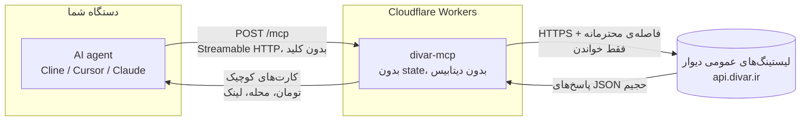

# دیوار MCP - هوش آگهی برای ایجنت‌ها


یه MCP سرور عمومیه که به ایجنت‌های هوش مصنوعی **دانش واقعی دیوار** می‌ده: جستجو تو **بزرگ‌ترین نیازمندی‌های ایران**، **قیمت به تومان**، دسته‌ها، شهرها و محله‌ها، کارکرد ماشین و مشخصات گوشی، ودیعه و اجاره، جزئیات آگهی، مقایسه و یه حکم زنده درباره‌ی قیمت. **فقط خواندنیه، بدون کلید. بدون لاگین و بدون شماره تلفن.**

**آدرس زنده:** `https://divar-mcp.mmdju2.workers.dev/mcp` (Streamable HTTP، بدون state)

**[English version](README.md)** · **[مثال‌ها](examples/sample-calls.md)** · **[مرجع ابزارها](docs/tools.md)** · **[تغییرات](CHANGELOG.md)**

## اتصال در ۳۰ ثانیه

هر MCP کلاینتی، **فقط یه آدرس**. Cline / Cursor / Claude Desktop (استایل `mcp.json`):

```json
{
  "mcpServers": {
    "divar": { "url": "https://divar-mcp.mmdju2.workers.dev/mcp" }
  }
}
```

بعدش فقط حرف بزن: **«پراید زیر ۳۰۰ میلیون»**، **«خونه دوخوابه اجاره تو تهران»**، **«این ۲۰۷ می‌ارزه؟»**، **«ارزون‌ترین آیفون ۱۳ تو مشهد»**.

کلاینت‌های MCP توی مرورگر هم کار می‌کنن - endpoint جواب preflight مرورگر (`OPTIONS /mcp`) رو می‌ده.

## ۷ ابزار

| ابزار | به چه دردی می‌خوره |
|---|---|
| `divar_suggest` | حرف مبهم به **عبارت واقعی جستجو، slug دسته، آیدی شهر و محله** - روی هر **۲۳۷ دسته** و **۱۱۷۷ شهر** |
| `search_ads` | «اینو نشونم بده»، چک قیمت - **فیلتر، مرتب‌سازی، صفحه‌بندی**؛ با یه call می‌شه تا ۵ صفحه رو هم دید |
| `ad_details` | همه‌چیز یه آگهی: **قیمت، مشخصات، امکانات، ارزیابی وضعیت، عکس، نقشه، انقضا، وضعیت چت، نوع فروشنده** |
| `get_ads_batch` | کارت‌های **تا ۱۰ توکن** - ورودی `compare_ads`، و هر کارت می‌گه فروشنده کیست و آگهی تا کی هست |
| `compare_ads` | «کدومشون؟» - **فقط مشخصاتی که واقعاً فرق دارن**، به‌علاوه میانهٔ همین مجموعه و جای هر آگهی |
| `find_best_value` | «بهترین X زیر Y تومان» - **گزینه‌ها بر اساس چیزی که بودجه‌ات واقعاً به آن می‌رسد رتبه‌بندی می‌شن**، سنجیده با بازار بدون سقف قیمت (`market_scale`) |
| `market_price` | **«این قیمت عادیه؟»** - میانهٔ یه نمونهٔ زنده، با تعداد نمونه و چیزهایی که در حساب نیاورده |

هر ۷ ابزار فقط خواندنیه (`readOnlyHint`) و هیچ کلید یا حسابی نمی‌خواد. MCP **prompts** هم هست (`compare-ads` و `best-under-budget`) و **resources** هم (`divar://cities`، `divar://categories`، `divar://category-filters/{slug}`) - داده‌های مرجع بدون سوزوندن یه tool call.

نکته‌ها برای سازنده‌های ایجنت:

- همه‌ی قیمت‌ها **تومانن** (۱ تومان = ۱۰ ریال) و آگهی توافقی `price_toman: null` می‌ده - هیچ‌وقت ۰. قیمت‌ها عوض می‌شن و آگهی‌ها ممکنه تو چند ساعت فروش برن: لینک آگهی رو به کاربر بده تا خودش چک کنه.
- **هر عددی که تو فیلد قیمت نوشته شده، قیمت نیست.** دیوار فیلد «قیمت توافقی» نداره، پس فروشنده‌ای که نمی‌خواد قیمت بده یه عدد الکی می‌زنه: سرچ ماشین یا موبایل رو بذار رو `cheapest` و بالای لیست پر می‌شه از آگهی‌های `۱,۰۰۰ تومان` (نقد و اقساط / تماس بگیرید). اینا آگهی واقعیان و هیچ‌وقت پنهان نمی‌شن، ولی هر کدوم **`price_is_placeholder`** با یه `price_placeholder_kind` و یه `price_note` ساده می‌گیرن، و هیچ‌وقت نه میانه رو تعیین می‌کنن نه `cheapest_toman` رو. همون یافته به شکل **`price_reading`** هم میاد - چی روشن شده، شاهدش چقدر قویه (`certain` برای شکل، `strong` برای عددی که با یه نمونه سنجیده شده) و اون میانه و تعداد نمونه و سهمی که باهاش قضاوت شده - چون اینکه این عدد رو چطور بخونی، تصمیم خودته. `market_price` جلوتر هم می‌ره و نمونه‌ش رو زیر **هر** برشی که زده منتشر می‌کند (`sample_views` / `sample_view_used`)، پس خوندن خام همیشه یه فیلد اون‌طرفه.
- **یه آگهی اجاره دو تا عدد داره و هر دو چک می‌شن.** `price_toman` اجارهٔ ماهانه‌ست و `deposit_toman` (ودیعه) بغلش میاد، هر کدوم با پرچم صداقت خودش - نبودن پرچم یعنی «این خط سالمه». تو لیست اجاره یه جنس دوم هم قاطی‌ست: آگهی‌ای که **خودش تو تایتلش** می‌گه همخونه‌ست (`همخونه` / `هماتاقی` / `اجاره اتاق`) **`shared_housing`** می‌گیره و از میانهٔ اجاره‌ی `market_price` کنار گذاشته می‌شه - قیمت یه اتاق، اجارهٔ یه واحد نیست.
- جستجوهای مبهم رو با **`divar_suggest`** شروع کن: محله **آیدی** می‌خواد، اسم به‌تنهایی فیلتر نمی‌کنه.
- هر چی **بودجه** یا کلمه‌ی **«بهترین»** داره با **`find_best_value`** برو؛ سرچ ساده فقط همون صفحه‌هایی رو می‌بینه که بگی.
- **آگهی‌های توافقی پنهان نمی‌شن.** `find_best_value` به‌طور پیش‌فرض فقط آگهی‌های قیمت‌دار رو رتبه‌بندی می‌کنه؛ با `include_negotiable: true` گزینه‌های «توافقی» هم می‌آن - آخر همه، با `price_toman: null` و یه خط «از فروشنده بپرس».
- **`market_price` کارنامه نیست.** خودش می‌گه چند آگهی رو سنجیده، قیمت‌های الکی و آگهی‌های توافقی رو از حساب بیرون می‌ذاره، نمونه‌ی زیر ۸ آگهی رو به‌عنوان معیار قبول نمی‌کنه، و تو هر جواب می‌گه که کارنامه‌ی خود دیوار نیست.
- نتیجه‌ها **سقف دارن** (پیش‌فرض ۱۰، حداکثر ۳۰) و `page` تا حداکثر ۵۰ میره - این سقف‌ها برای حفظ کانتکست ایجنتن. فارسی هم نرمال می‌شه (ی/ک عربی، ارقام فارسی، نیم‌فاصله)؛ اگه یه املا خالی برگرده، یه بار با املاهای دیگه امتحان می‌شه.
- **هشت مکالمه‌ی آماده‌ی کپی-پیست** تو **[examples/sample-calls.md](examples/sample-calls.md)** هست، و مرجع کامل پارامترها، فیلترهای معتبر هر دسته و چیزهایی که عمداً غایبن تو **[docs/tools.md](docs/tools.md)**.

## چطور کار می‌کنه

یه سؤال چطور به جواب تبدیل می‌شه. تو این مسیر هیچ داده‌ای از کاربر ذخیره نمی‌شه.



یعنی چی:

- **بدون state.** هر درخواست مستقلِ - بدون سشن، بدون اکانت، بدون چیزی که لازم باشه لاگین کنی.
- **فقط خواندنی.** هر ۷ ابزار `readOnlyHint` دارن. اینجا هیچ‌چیزی نمی‌تونه آگهی بذاره، عوض کنه یا پاک کنه.
- **بدون داده‌ی کاربر.** هیچی از تو ذخیره نمی‌شه. تنها چیزی که می‌مونه یه کش کوتاه‌مدته (۱۰ دقیقه برای سرچ و جزئیات، ۲۴ ساعت برای لیست شهرها و دسته‌ها).
- **حواس‌جمع به rate-limit.** درخواست‌های سرچ با ۸۰۰ میلی‌ثانیه فاصله می‌رن، جزئیات با ۲ ثانیه و backoff، و لیست مدل‌های دیوار یه روز کش می‌مونه - یعنی فشار تو، به‌شکل فشار به دیوار بیرون نمی‌زنه.
- **API مستندنشده.** وب‌API عمومی دیوار بدون اطلاع عوض می‌شه؛ برای همین همین [اسکریپت verify](scripts/verify-live.mjs) وجود داره تا این تغییرات دیده بشن.

## اعتماد، قابل راستی‌آزمایی

حرف منو قبول نکن - خودت سرور زنده رو چک کن:

```bash
node scripts/verify-live.mjs   # فقط Node.js ۱۸ می‌خواد، نصب لازم نداره
```

هر ۷ ابزار رو روی Streamable HTTP لیست می‌کنه، یه سرچ + جزئیات + یه `market_price` + چک حریم خصوصی + مسیرهای خطا رو اجرا می‌کنه، قرارداد صداقت دیتا رو چک می‌کنه (قیمت تومانی، توافقی = `null`، خطای راهنما) و نسخه‌ای که سرویس زنده گزارش می‌ده رو با آخرین ریلیز همین ریپو مقایسه می‌کنه - یعنی یه دیپلوی عقب‌مونده نمی‌تونه بی‌صدا بمونه. همون اسکریپت **ساعتی تو CI** هم اجرا می‌شه ([](https://github.com/mmdju/divar-mcp/actions/workflows/verify.yml)). معماری کامل تو [docs/architecture.md](docs/architecture.md) و کلاینت آماده تو [examples/python.py](examples/python.py).

## حریم خصوصی

شماره تلفن لاگین خود فروشنده رو می‌خواد و **این سرور هیچ‌وقت لاگین نمی‌کنه و هیچ‌وقت شماره برنمی‌گردونه** - نه تو سرچ نه تو جزئیات، هیچ فیلد `phone` یا `mobile` یا `contact_number` نیست. آگهی‌ها لینک داده می‌شن، نه تماس گرفته: کاربر خودش با فروشنده حرف می‌زنه.

## منبع داده

لیستینگ‌های عمومی وب دیوار (**مستند نیست، بدون اطلاع قبلی عوض می‌شه**). این پروژه **وابسته به دیوار نیست** و تأییدش رو نداره.

## وضعیت

**سرویس عمومی رایگان** روی Cloudflare Workers. **مصرف منصفانه: ۶۰ درخواست در دقیقه به‌ازای هر IP** روی `/mcp` (پاسخ `429` با `retry-after`) - هم تو کد سرور و هم با یه قاعده‌ی لبه‌ی کلادفلر؛ جزئیات تو [SECURITY.md](SECURITY.md).

## لایسنس

ریپوی ویترین (**فقط داک، بدون سورس**) - ببین [LICENSE](LICENSE). نکته‌های امنیتی تو [SECURITY.md](SECURITY.md). نسخه‌ی انگلیسی تو [README.md](README.md).
