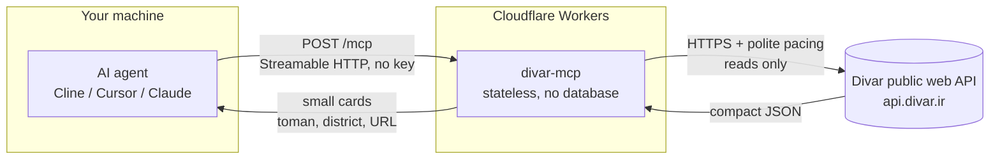

# Architecture

How a question becomes an answer. No user data is stored anywhere in this path.

What this means:

- **Stateless.** Every request stands alone - no sessions, no accounts, nothing to log in to.
- **Read-only.** All 6 tools carry `readOnlyHint`. Nothing here can change, delete or post anything.
- **No storage.** The only memory is a short-lived response cache (minutes, per isolate). Prices are re-read from Divar every time the cache expires.
- **Rate-limit aware.** Search is calm; details calls are spaced (2s) with backoff, and Kenar model lookups are cached 24h - bursts never leave this box as bursts.
- **Privacy by design.** Phone numbers need the seller's own login. This server never logs in, so contact fields simply cannot appear in any response.
- **Undocumented upstream.** Divar's public API can change without notice - this service tracks it and adapts, which is exactly why the [verify script](scripts/verify-live.mjs) exists.

Verify it yourself: `node scripts/verify-live.mjs` (needs Node.js 18+, nothing to install).
